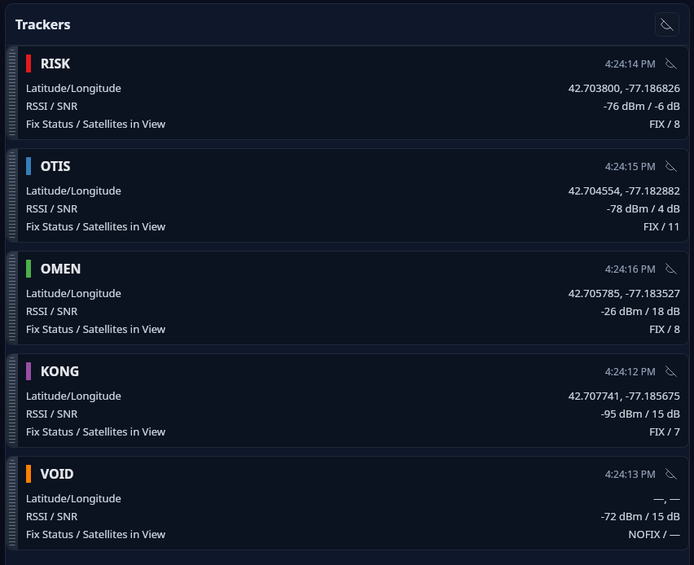
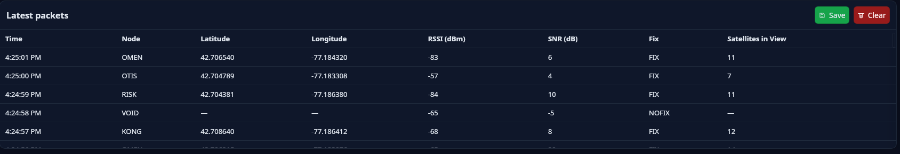

# Dispatch User Guide

Dispatch is a ground station application for all Wild West Rocketry products. It can receive and visualize telemetry from LoRa-based tracker nodes. It displays live GPS positions, signal quality metrics, and a scrolling packet log. It also lets you push configuration changes directly to connected devices.

---

## Table of Contents

1. [Connecting to a Device](#1-connecting-to-a-device)
2. [Tracking Tab](#2-tracking-tab)
   - [Map](#map)
   - [Trackers Panel](#trackers-panel)
   - [Packet Log](#packet-log)
3. [Config Tab](#3-config-tab)
   - [Probing](#probing)
   - [Configurable Fields](#configurable-fields)
   - [Sending Configuration](#sending-configuration)
   - [Log](#log)
4. [Demo Mode](#4-demo-mode)
5. [Exporting Data](#5-exporting-data)

---

## 1. Connecting to a Device

The connection controls are in the toolbar at the top of the window.

| Control | Description                                                                   |
|---|-------------------------------------------------------------------------------|
| **Port** | Dropdown listing all detected serial ports. Click the refresh icon to rescan. |
| **Baud** | Serial baud rate. Defaults to `9600`.                                         |
| **Connect** | Opens the selected port and begins listening for packets.                     |
| **Disconnect** | Closes the port and stops packet reception.                                   |

**Steps:**

1. Plug in your LoRa receiver via USB.
2. Click the refresh icon next to the Port dropdown to populate the list.
3. Select your device's port from the dropdown.
4. Set the correct baud rate for your firmware (should be `9600`).
5. Click **Connect**.

If the connection fails, a **"Failed to connect"** notice appears next to the Port dropdown. Double-check the port selection, baud rate, and that no other application has the port open.

---

## 2. Tracking Tab

The Tracking tab is the default view. It shows the live map, tracker status cards, and a scrolling packet log.

<!-- TODO: Screenshot full Tracking tab with map, trackers panel, and packet log -->

### Map

The map displays each tracker's current position as a colored circle marker, and draws a polyline trail of its recent path (up to 200 points).

<!-- TODO: Screenshot map with two tracker markers and trails -->

- **Zooming and panning** work with standard mouse controls (scroll to zoom, click-drag to pan).
- The map automatically pans and zooms to the most recently updated tracker when new position data arrives.
- Clicking a marker opens a **popup** showing:
  - Node ID
  - Latitude / Longitude
  - RSSI and SNR
  - Fix status and satellite count

<!-- TODO: Screenshot marker popup -->

### Trackers Panel

The right-hand panel lists every tracker seen since the current session started.

Each card shows:

| Field | Description |
|---|---|
| **Node ID** | Tracker identifier — either `CALLSIGN-NodeID` (if a callsign is set) or `Node N`. |
| **Last seen** | Time of the most recent packet from that node. |
| **Callsign** | Amateur radio callsign, if broadcast by the device. |
| **Latitude / Longitude** | Most recent GPS fix (6 decimal places). |
| **RSSI / SNR** | Received Signal Strength Indicator (dBm) and Signal-to-Noise Ratio (dB). |
| **Fix Status / Satellites** | GPS fix quality and number of satellites in view. |

**Fix status values:**

| Value | Meaning |
|---|---|
| `FIX` | Standard GPS fix |
| `DIFF` | Differential GPS fix |
| `EST` | Estimated position |
| `NOFIX` | No GPS fix |
| `UNKNOWN` | Status not reported |

**Visibility controls:**

- Click the **eye icon** on a card to hide or show that tracker's marker and trail on the map. Hidden trackers appear dimmed.
- Click the **eye icon in the panel header** to toggle all trackers at once.

**Reordering:**

Drag the handle on the left edge of a tracker card to reorder the list.

---

### Packet Log

The lower portion of the left column shows a table of the most recent packets received (up to 500 entries, newest first).

Columns: **Time**, **Node**, **Latitude**, **Longitude**, **RSSI (dBm)**, **SNR (dB)**, **Fix**, **Satellites in View**.

Rows with missing data show `—` in place of unavailable fields.

**Log controls** (top-right of the table card):

- **Save** — Export all current packets to a CSV file (see [Exporting Data](#5-exporting-data)).
- **Clear** — Discard all packets from the current session view. New packets continue to arrive and will populate the table fresh.

---

## 3. Config Tab

The Config tab lets you read and write configuration values on a connected device over the serial link.

<!-- TODO: Screenshot Config tab with fields and log panel -->

> The Config tab requires an active connection. If no device is connected, the fields are disabled and a prompt is shown.

> Configuring Deputy v1.0 is unsupported due to hardware limitations. Therefore, it is recommended that you only change the node ID and callsign for now. 

### Probing

When you connect, Dispatch automatically sends a `config` command to the device and listens for 2 seconds to discover which fields the firmware supports. This is called **probing**.

<!-- TODO: Screenshot Config tab while probing, showing "Probing…" button state -->

- Fields the device does **not** support are shown as disabled with a **Not available** badge.
- To re-probe manually, click the **Probe** button in the card header.

### Configurable Fields

| Field | Range / Format     | Notes |
|---|--------------------|---|
| **Frequency (MHz)** | 902 – 928 MHz      | Up to 6 decimal places, e.g. `903.123456` |
| **Node ID** | 0 – 9              | Integer identifier for the tracker node |
| **Callsign** | Up to 6 characters | Uppercase only. Licensed amateur radio operators only. |

Fields are only editable if the connected device reports support for them.

### Sending Configuration

1. Enter values in any enabled fields.
2. Click **Send**.

Dispatch sends each changed field as a `config <key> <value>` command over serial, waits for the device's response, and moves to the next field.

> **Note:** Settings are saved to device flash and take effect after the device reboots.

<!-- TODO: Screenshot Config tab after sending, with log showing sent commands and responses -->

### Log

The log panel on the right of the Config tab records all serial activity during the configuration session:

| Color / style | Meaning |
|---|---|
| **Sent** | Command sent to the device |
| **Received** | Response received from the device |
| **Error** | Communication error |
| **Info** | Status messages from Dispatch |

Click **Clear** in the log header to wipe the log.

---

## 4. Demo Mode

Dispatch includes a built-in simulation for testing without hardware.

1. In the Port dropdown, select **URRG Demo Simulation**.
2. Click **Connect**.

The simulation generates four moving tracker nodes (`RISK`, `OTIS`, `OMEN`, `KONG`) near a fixed base location, plus a fifth node (`VOID`) that reports no GPS fix. All tracker and packet features work normally in demo mode.

<!-- TODO: Screenshot Tracking tab running the demo simulation with four tracker trails on the map -->

Click **Disconnect** to stop the simulation.

---

## 5. Exporting Data

To export the current packet log as a CSV file:

1. Go to the **Tracking** tab.
2. Click the **Save** button (floppy disk icon) in the "Latest packets" card header.
3. Choose a save location in the file dialog. The default filename includes a timestamp, e.g. `packets-2026-01-01T00-00-00-000Z.csv`.

The exported CSV contains one row per packet with columns: `node_id`, `lat`, `lon`, `rssi`, `snr`, `fix_status`, `sats`, `ts`.